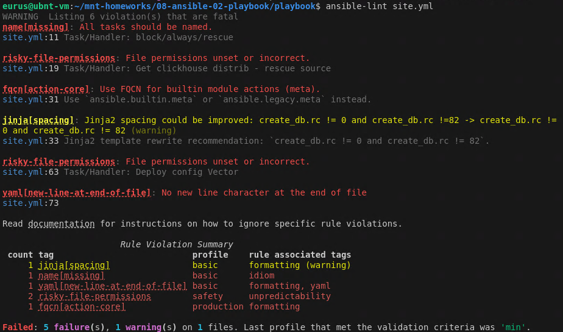
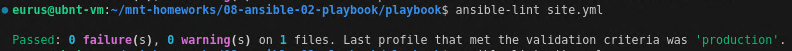
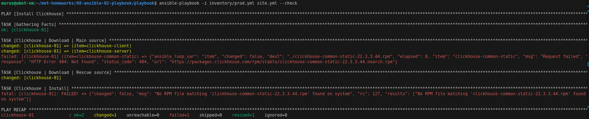
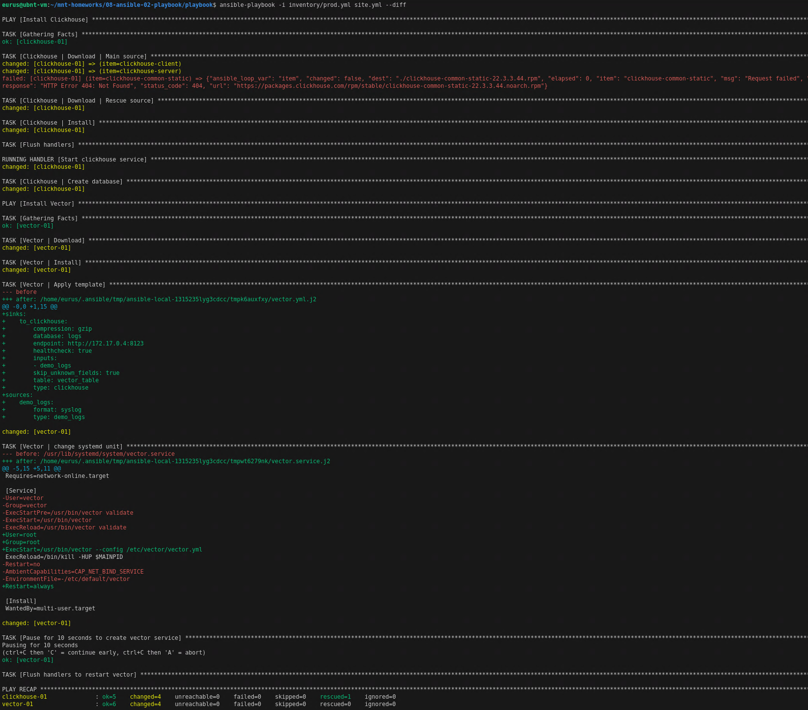
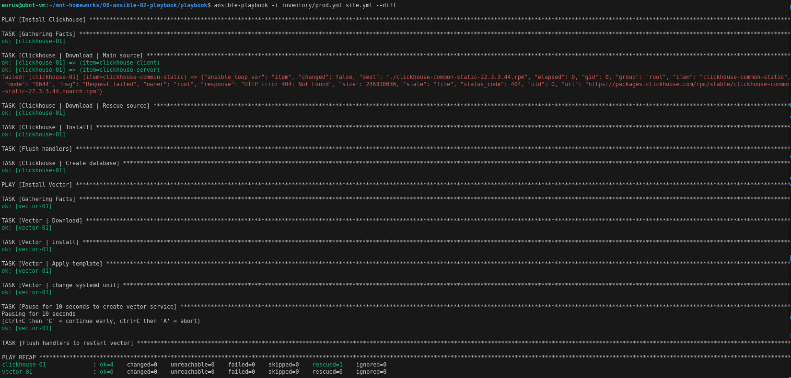

# Домашнее задание к занятию 2 «Работа с Playbook»

## Подготовка к выполнению

## Основная часть

1. Подготовлен inventory-файл `prod.yml` с добавлением хостов для `vector`. Развертывание все так же через `docker compose`, образ `pycontribs/centos:7`
2. Создан play `Install vector` для хостов `vector` из `inventory`. Таски обозначены тэгом `vector`. Шаблон честно взят из интернета чисто для проверки `ansible.builtin.template`
3. Можно пойти по пути наименьшего сопротивления и взять сразу установочный пакет rpm для vector через `get_url`
4. После установки vector добавил паузу в 10 секунд, чтобы vector успел отметиться в systemctl

> 5. Запуск `ansible-lint site.yml`

Ошибки:
- Не задано имя task
- Не заданы права на файл
- Для встроенного модуля использовано короткое имя вместо полного имени коллекции
- Отсутствует пустая строка в конце файла

Предупреждения:
- Неподдерживаемый параметр
- Отсутствие пробела в шаблоне

Исправление и повторный запуск `ansible-lint site.yml`

6. При запуске с флагом `--check` возникает ошибка в таске установки clickhouse, поскольку `--check` выполняет только проверку, но не сами действия. Соответственно, он не скачивает дистрибутив в предыдущем таске

7. Первый запуск на `prod.yml` окружении с флагом `--diff`

8. Повторный запуск playbook с флагом `--diff` — изменений нет, playbook идемпотентен

9. Ссылка на описаниее Playbook

https://github.com/WilderWein123/ansible-02-playbook/blob/main/playbook/Readme.md
